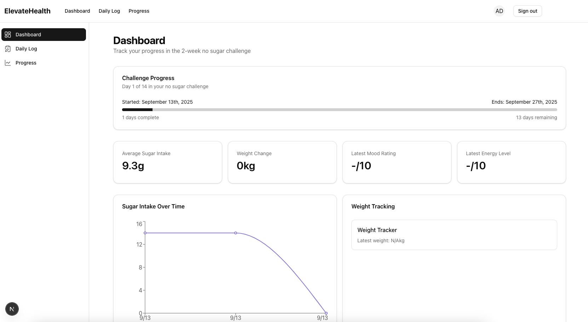

# Elevate Health

A modern health and nutrition tracking application built with Next.js, Supabase, and TypeScript. Track your meals, monitor your nutrition, and achieve your health goals with ease.



## ✨ Features

- **Barcode Entering**: Quickly log food items by entering barcodes
- **Nutrition Tracking**: Monitor your daily macronutrient and calorie intake
- **User Authentication**: Secure sign-up and login with email/password
- **Responsive Design**: Works seamlessly on both desktop and mobile devices
- **Data Visualization**: Track your progress with beautiful charts and statistics

## 🚀 Getting Started

### Prerequisites

- Node.js 18.0 or later
- npm or yarn
- Supabase account

### Installation

1. Clone the repository

   ```bash
   git clone https://github.com/AdamElitzur/ElevateHealth.git
   cd ElevateHealth
   ```

2. Install dependencies

   ```bash
   npm install
   # or
   yarn install
   # or
   pnpm install
   ```

3. Set up environment variables
   Create a `.env.local` file in the root directory and add your Supabase credentials:

   ```env
   NEXT_PUBLIC_SUPABASE_URL=your-supabase-url
   NEXT_PUBLIC_SUPABASE_ANON_KEY=your-supabase-anon-key
   SUPABASE_SERVICE_ROLE_KEY=your-service-role-key
   ```

4. Run the development server

   ```bash
   npm run dev
   # or
   yarn dev
   # or
   pnpm dev
   ```

5. Open [http://localhost:3000](http://localhost:3000) in your browser

## 🛠️ Tech Stack

- **Frontend**: Next.js 13+ with App Router
- **Styling**: Tailwind CSS
- **Authentication**: Supabase Auth
- **Database**: Supabase PostgreSQL
- **State Management**: React Context API
- **Form Handling**: React Hook Form with Zod validation
- **UI Components**: Radix UI Primitives
- **Icons**: Lucide React
- **Charts**: Recharts

## 📱 Screenshots

### Dashboard Overview

## 🤝 Contributing

Contributions are welcome! Please feel free to submit a Pull Request.

1. Fork the repository
2. Create your feature branch (`git checkout -b feature/AmazingFeature`)
3. Commit your changes (`git commit -m 'Add some AmazingFeature'`)
4. Push to the branch (`git push origin feature/AmazingFeature`)
5. Open a Pull Request

## 📄 License

This project is licensed under the MIT License.

## 🙏 Acknowledgments

Made with ❤️ by Sako, Amos Appendino, Adam Elitzur, Betina Kitzler, Arzu Suleymanova, and Diya Patlolla.

## Supabase schema:

-- WARNING: This schema is for context only and is not meant to be run.
-- Table order and constraints may not be valid for execution.

CREATE TABLE public.daily_logs (
id uuid NOT NULL DEFAULT uuid_generate_v4(),
user_id uuid NOT NULL,
date date NOT NULL,
sugar_intake_grams numeric,
weight_kg numeric,
mood_rating integer CHECK (mood_rating >= 1 AND mood_rating <= 10),
cravings_rating integer CHECK (cravings_rating >= 1 AND cravings_rating <= 10),
energy_rating integer CHECK (energy_rating >= 1 AND energy_rating <= 10),
sleep_rating integer CHECK (sleep_rating >= 1 AND sleep_rating <= 10),
notes text,
product_name text,
product_barcode text,
meal_category text,
meal_time time without time zone,
created_at timestamp with time zone NOT NULL DEFAULT now(),
updated_at timestamp with time zone NOT NULL DEFAULT now(),
CONSTRAINT daily_logs_pkey PRIMARY KEY (id),
CONSTRAINT daily_logs_user_id_fkey FOREIGN KEY (user_id) REFERENCES auth.users(id)
);
CREATE TABLE public.food_entries (
id uuid NOT NULL DEFAULT uuid_generate_v4(),
user_id uuid NOT NULL,
daily_log_id uuid NOT NULL,
created_at timestamp with time zone NOT NULL DEFAULT now(),
updated_at timestamp with time zone NOT NULL DEFAULT now(),
product_name text NOT NULL,
product_barcode text,
brand text,
sugar_grams numeric,
calories numeric,
serving_size text,
meal_category text,
meal_time time without time zone,
notes text,
CONSTRAINT food_entries_pkey PRIMARY KEY (id),
CONSTRAINT food_entries_user_id_fkey FOREIGN KEY (user_id) REFERENCES auth.users(id)
);
CREATE TABLE public.users (
id uuid NOT NULL,
created_at timestamp with time zone NOT NULL DEFAULT now(),
updated_at timestamp with time zone NOT NULL DEFAULT now(),
first_name text,
last_name text,
avatar_url text,
age integer,
gender text,
height_cm integer,
initial_weight_kg numeric,
goal_weight_kg numeric,
challenge_start_date date DEFAULT CURRENT_DATE,
challenge_end_date date DEFAULT (challenge_start_date + '14 days'::interval),
CONSTRAINT users_pkey PRIMARY KEY (id),
CONSTRAINT profiles_id_fkey FOREIGN KEY (id) REFERENCES auth.users(id)
);
